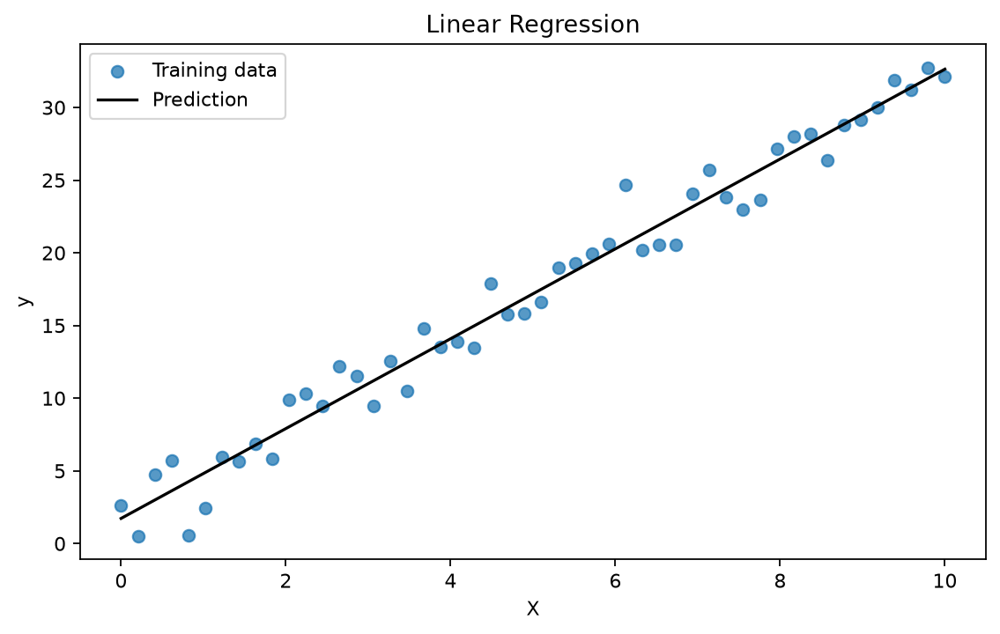
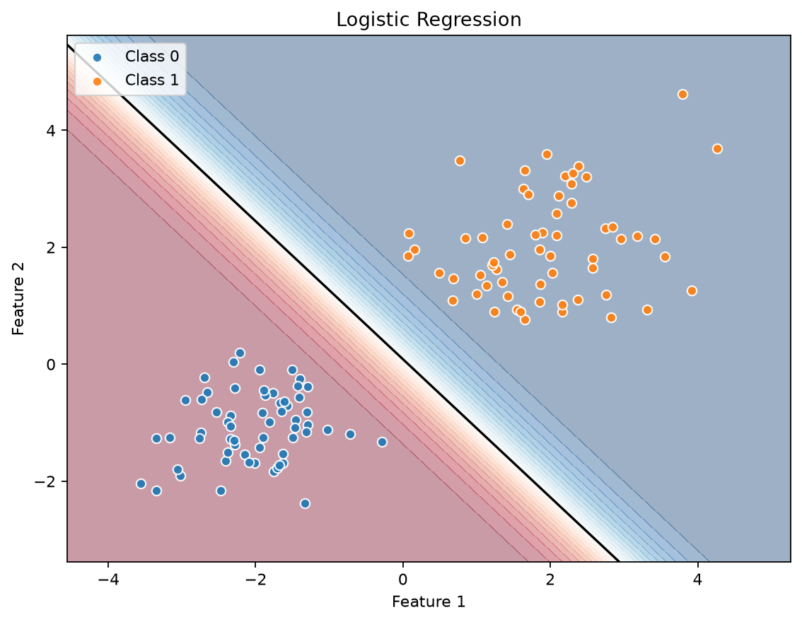
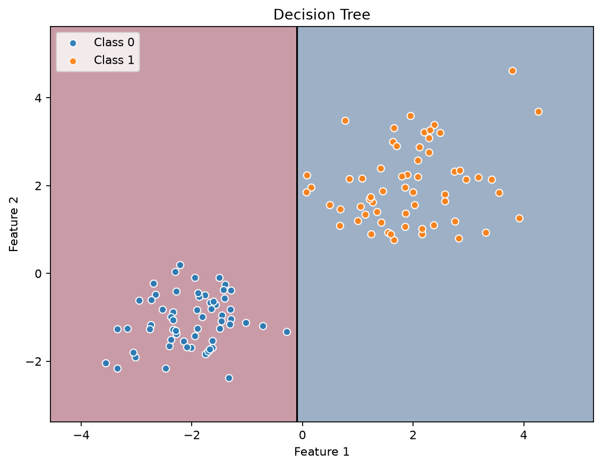
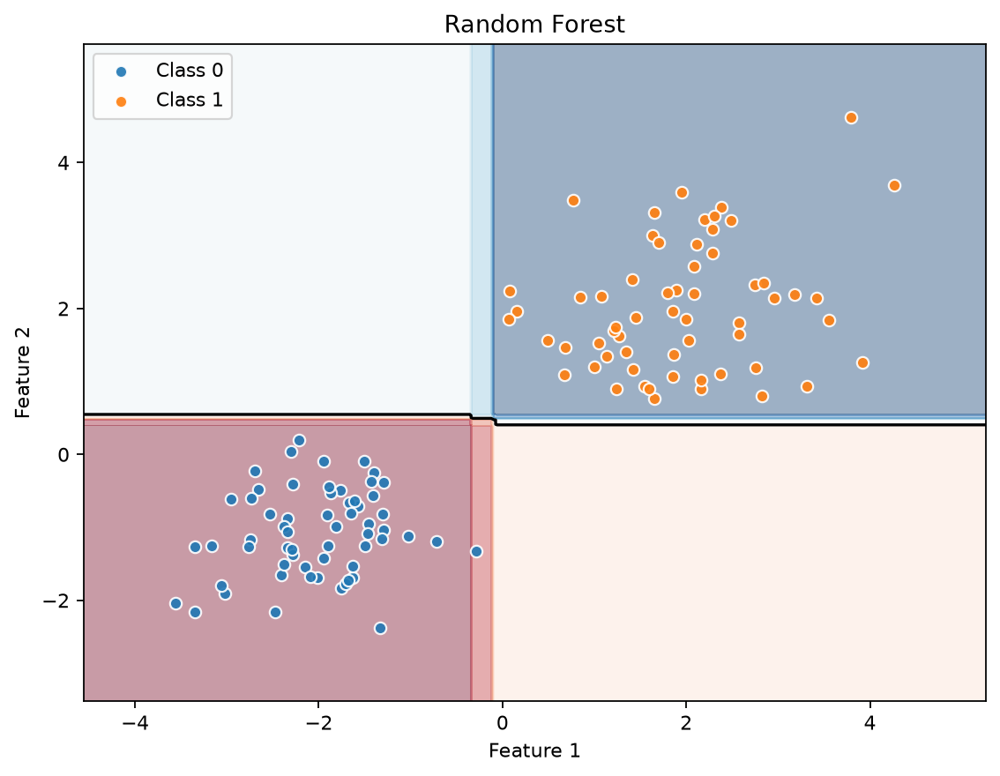
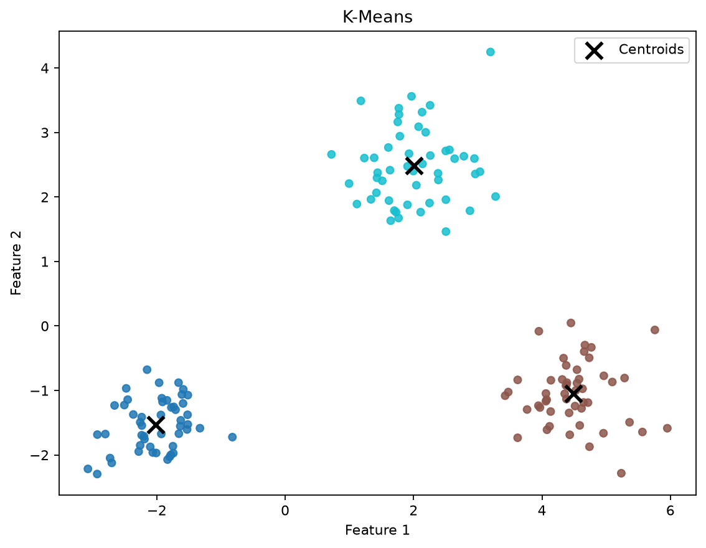
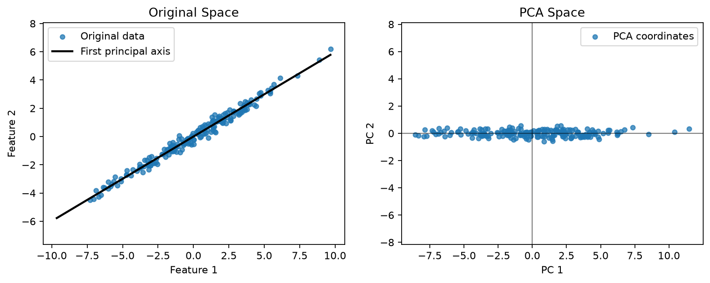

# ML From Scratch
[](https://github.com/ArsPoghosyan/ml-from-scratch/actions/workflows/ci.yml)

Core machine learning algorithms implemented from scratch with Python and NumPy.

## Scikit-learn Comparison

This project follows the same basic workflow as scikit-learn: `fit`, `predict`, `transform`, fitted attributes, and input validation. The code is intentionally small and readable, so the point is clarity and correctness rather than matching scikit-learn's optimized internals.

| Model in this repo | scikit-learn equivalent | Notes |
| --- | --- | --- |
| `LinearRegression` | `sklearn.linear_model.LinearRegression` | Ordinary least squares with an intercept option. |
| `LogisticRegression` | `sklearn.linear_model.LogisticRegression` | Binary classification trained with gradient descent. |
| `DecisionTreeClassifier` | `sklearn.tree.DecisionTreeClassifier` | Greedy split search with classification impurity. |
| `DecisionTreeRegressor` | `sklearn.tree.DecisionTreeRegressor` | Greedy split search with squared-error reduction. |
| `RandomForestClassifier` | `sklearn.ensemble.RandomForestClassifier` | Ensemble of tree classifiers with bootstrap and feature subsampling. |
| `RandomForestRegressor` | `sklearn.ensemble.RandomForestRegressor` | Ensemble of tree regressors with bootstrap and feature subsampling. |
| `KMeans` | `sklearn.cluster.KMeans` | Multi-start k-means with `random` and `k-means++` initialization. |
| `PCA` | `sklearn.decomposition.PCA` | SVD-based PCA with optional whitening. |

The main differences are practical: these implementations stay in pure NumPy, keep the API surface small, and avoid the extra machinery that scikit-learn needs for scale and broad compatibility.

## Usage

The example scripts under `examples/` build synthetic data, fit each estimator, and plot the result.

```python
from ml_from_scratch import (
    DecisionTreeClassifier,
    KMeans,
    LinearRegression,
    LogisticRegression,
    PCA,
    RandomForestClassifier,
)
```

| Model | Plot |
| --- | --- |
| `LinearRegression` |  |
| `LogisticRegression` |  |
| `DecisionTreeClassifier` |  |
| `RandomForestClassifier` |  |
| `KMeans` |  |
| `PCA` |  |

## Project Layout

```text
ml_from_scratch/
  base.py
  linear_model/
  tree/
  cluster/
  decomposition/
  utils/
tests/
examples/
```

## Setup

```powershell
python -m venv venv
.\venv\Scripts\Activate.ps1
pip install -r requirements.txt
```

## Development

Run tests with:

```powershell
pytest
```

Examples live in `examples/`. Package code lives in `ml_from_scratch/`.

Note: this project is a learning project built to practice implementing common machine learning algorithms from scratch.
